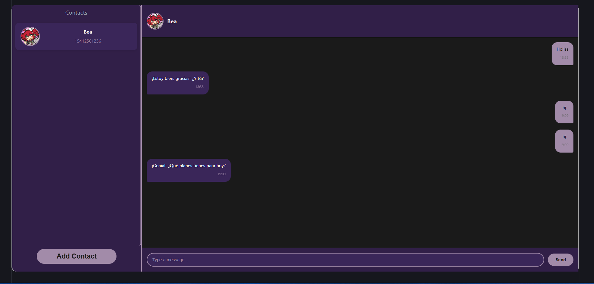
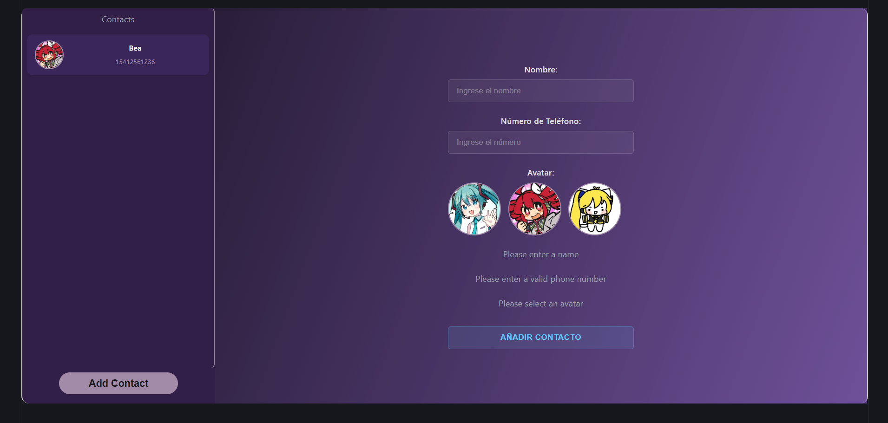
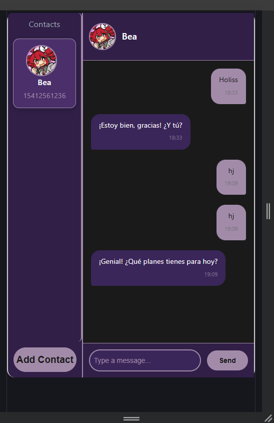
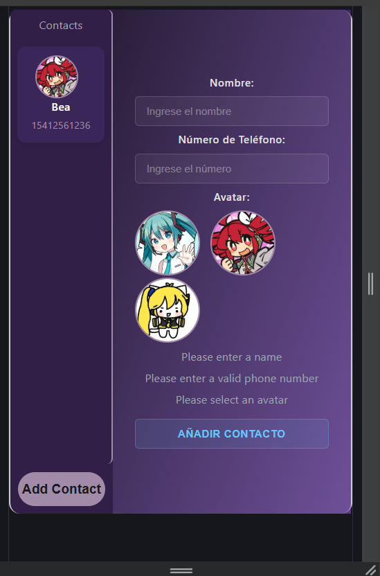

# UTN - Curso de Desarrollo en React JS  
## Unidad 1 — Joaquin Della Vecchia

---

## 🚀 Cómo ejecutar el proyecto

# Metodo 1:
Para correr el proyecto localmente:

1. Abrí una terminal en la carpeta raíz del proyecto  
   (la que contiene `src`, `public`, etc.)

2. Ejecutá el siguiente comando:

```bash
npm run dev
```

# Metodo 1:
El proyecto esta subido en Vercel bajo el siguiente link para probarlo online

## Preview

# Preview desde desktop





# Preview desde mobile






### Autor

Joaquin Della Vecchia Ramirez, estudiante del Curso de Desarrollo en React JS
Modulo 2, Unidad 1


## Creditos Adicionales de las imagenes

[foto de pefil miku (celeste)](https://ar.pinterest.com/pin/577586721002962961/)

[foto de perfil neru (amarilla)](https://ar.pinterest.com/pin/4503668372649194/)

[foto de perfil teto (roja)](https://ar.pinterest.com/pin/4503668372649209/)
